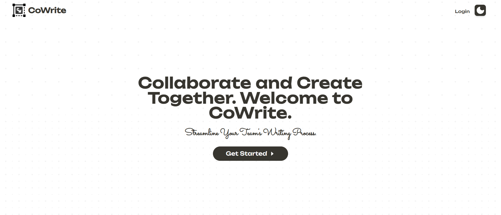
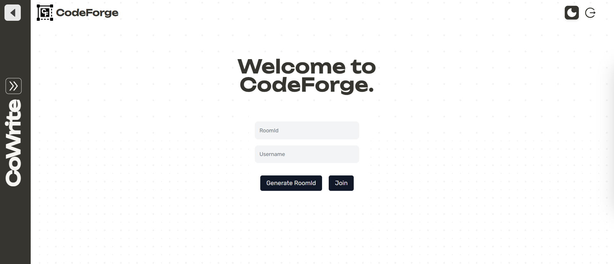
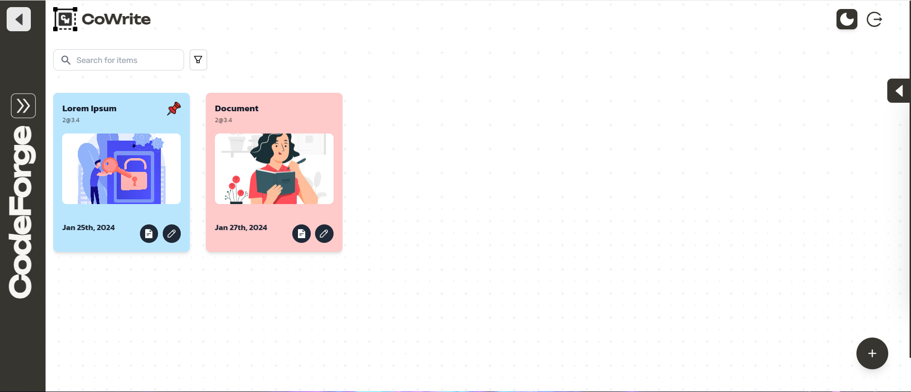
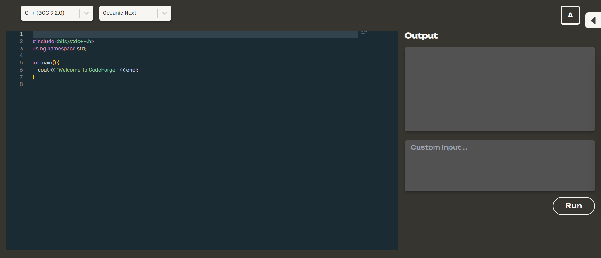

# CoWrite

# Brief Overview

- CoWrite is a notion like real time collaborative text-editor built using NextJS 14.1, Redux-Toolkit, TailwindCSS, Prisma, MongoDB, Zod, Typescript, Socket.io, Cloudinary, EditorJS.
- It has responsive UI as well as dark-mode for all those night owls out there.
- It supports features such as native authentication and password reset, creating, deleting and updating documents, owners can also give access to documents they creating to others as well as revoke this access. The secondary users can only view and update the shared documents.
- It has a socket.io integration so all changes are visible in real time, and participants currently viewing or changing the document are alsp visible.
- This app has another mode i.e. the code editor CODEFORGE for my programmer buddies built using Monaco.
- Like the text editor, codeforge also has the real time and collaborative features.

# Tech Stack

- **Frontend:** NextJS 14.1, Redux-Toolkit, Redux-persist, TailwindCSS, Prisma, Zod, Socket.io-Client, Typrscript, Prisma, Zod
- **Database:** MongoDB
- **Cloud:** Cloudinary
- **Text Editors:** EditorJS, Monaco
- **API:** ExpressJS, Socket.io, Morgan, Nodemon, dotenv

# **ScreenShots**

- [ ] 
